<h1 align="center">こんにちは、takau-jp です</h1>

<p align="center">
  <a href="https://www.42tokyo.jp/"></a>
  
</p>

## 自己紹介

**42Tokyo** で、C / C++ で標準ライブラリやシェルなどをスクラッチ開発で実装する課題を通して、低レイヤー・システムプログラミングを軸に学んでいます。
42Tokyoでの学習では、課題を足がかりに、その根底にある原理への理解とそれを応用した独自の発想を重点においています。
2025年の42Tokyo Awardにて、2025年の *MVS（Most Valuable Student）*に選んでいただきました。


## スキル

### 言語


## 主なプロジェクト

42 Cursus で取り組んだプロジェクトの一部です。

| プロジェクト | ひとことで言うと | 身についたこと | 言語 |
| ------------ | ---------------- | -------------- | ---- |
| 🧰 [libft](https://github.com/takau-jp/libft) | C の標準ライブラリを自作 | C の基礎・メモリ管理・ライブラリ設計・IEEE 754・UTF-8・ビルド最適化 | C |
| 🗺️ [fdf](https://github.com/takau-jp/fdf) | 地形データを 3D ワイヤーフレームで描画 | 3D グラフィックス・線形代数・行列/クォータニオン・描画アルゴリズム・レンダリングパイプライン | C |
| 🔢 [push_swap](https://github.com/takau-jp/push_swap) | 数列を少ない手数で並び替えるソート | アルゴリズム設計・計算量の最適化・探索/ヒューリスティクス・データ分析によるチューニング | C |
| 📡 [minitalk](https://github.com/takau-jp/minitalk) | シグナルだけで文字列を送受信 | プロセス間通信・シグナル制御・ビット操作・UTF-8 の規格準拠処理 | C |
| 🍝 [philosophers](https://github.com/takau-jp/philosophers) | 並行処理の古典問題をシミュレーション | マルチスレッド・マルチプロセス・排他制御（mutex/セマフォ）・デッドロック回避・時間制御 | C |
| 🐚 [minishell](https://github.com/takau-jp/minishell) 👥 | bash の自作（チーム開発） | チーム開発の経験/字句・構文解析・AST・プロセス制御・パイプ/リダイレクト・環境変数・シグナル処理 | C |
| 🟩 [Wordle](https://github.com/takau-jp/Wordle) 👥| 単語当てゲーム（CLI・Web）（チーム開発）  | Web フロントエンド・状態管理 | C++ ・ TypeScript |
| 🚧 miniRT 👥 *(開発中)* | レイトレーシングで 3DCG を描画（チーム開発） | レイトレーシング・幾何・光学・ベクトル演算・交差判定 | C |

> 👥 ＝ チーム開発のプロジェクト

<p align="center">
  
</p>

> ポートフォリオとして公開許可を得て一時的に公開しています。
>
> 各プロジェクトの詳しい内容は下の「プロジェクト詳細」を開いてご覧ください 👇

## プロジェクト詳細

<details>
<summary><b>🧰 libft — C の標準ライブラリを自作</b></summary>

**ひとことで言うと**: `strlen` や `printf` 系といった C の定番関数を、標準ライブラリを使わずに自分で作り直したライブラリです。他のすべての課題の土台になっています。

### 📦 何ができる？

| カテゴリ | 内容 |
| --- | --- |
| 文字・文字列・メモリ操作 | 文字種の判定、文字列の分割・結合・切り出し、メモリのコピーなど定番を網羅 |
| 数値変換・メモリ確保 | 文字列⇔数値の変換、ゼロ初期化付きの確保（`calloc`）、再確保（`realloc`） |
| 連結リスト | 追加・削除・走査に加え、スタック / キュー的な push / pop 操作も用意 |
| 数学・乱数 | 平方根・四捨五入・絶対値、xorshift 法による高速な乱数生成 |
| get_next_line | ファイルから 1 行ずつ読み込む関数も同梱 |

### ✨ こだわり①｜「ライブラリ」としての設計

単なる関数の寄せ集めではなく、**他人が使うライブラリ**として使い勝手と保守性を意識しました。

| 工夫 | 内容 |
| --- | --- |
| 公開 / 非公開をヘッダで分離 | 利用者が触れてよい API だけを公開し、内部実装のシンボルは隠蔽。使う側が内部を意識せず安全に使える |
| IWYU でビルド時間を約 20% 削減 | 必要な分だけ include する（Include What You Use）方針で不要な依存を整理し、ビルドを高速化 |

### ✅ こだわり②｜仕様（マニュアル）に忠実な実装

「動けば OK」ではなく、**規格や man を読み込み、本物と同じ挙動**を目指しました。

| 観点 | 内容 |
| --- | --- |
| C 標準規格・未定義動作の回避 | 規格を参照して未定義動作を避け、環境やコンパイラが変わっても安定して動く実装を徹底 |
| IEEE 754（浮動小数点数） | ビット表現や丸めルールを規格通りに扱い、小数を正確に変換・出力（`ft_printf` / `ft_strtod`） |
| UTF-8（Unicode） | マルチバイト文字を正しく検証・エンコードし、絵文字などもきちんと処理 |

### 🔍 特に作り込んだ 2 つの関数

**`ft_printf` — `printf` の自作版**

`printf` の **C 標準機能をほぼ網羅**して自作しました。

| 機能 | 内容 |
| --- | --- |
| 複雑な書式指定 | フラグ（`-` `+` ` ` `#` `0`）・幅・精度・長さ修飾子の組み合わせまで標準仕様どおりに処理 |
| 小数まで自前で出力 | `%f` `%e` `%g` `%a` に対応。IEEE 754 のビット表現を直接読み解き、最近接偶数丸めで正確に表示。`double`（binary64）と `long double`（binary80）の両方を共通化して実装 |
| UTF-8 対応 | マルチバイト文字（絵文字など）も正しく出力 |
| 出力先の切り替え | 任意の fd に書く `ft_dprintf`、文字列へ書く `ft_snprintf` も実装 |

**`ft_strtod` — 文字列を小数に変換**

「`"3.14"` という文字列を小数 `3.14` に変換する」関数を、**誤差が出ないよう小数演算を一切使わずに**実装しました。途中計算には浮動小数点を使わず、**多倍長整数の配列で固定小数点（整数部 309 桁＋小数部 1075 桁）を表現**し、整数演算だけで正確な小数を組み立てます。これにより、簡易な実装では避けられない丸め誤差を排し、**正確な数値への変換**を実現しています。`0x1.8p3` のような 16 進小数や `inf` / `nan` にも対応しています。

</details>

---

<details>
<summary><b>🗺️ fdf — 地形データを 3D ワイヤーフレームで描画</b></summary>

**ひとことで言うと**: 標高（高さ）が書かれたファイルを読み込んで、それを 3D の立体的な地形（針金細工のようなワイヤーフレーム）として画面に描くビューアです。描画には学校指定のライブラリ MiniLibX を使用しています。

> 📝 開発中に起きた投影バグの顛末を Qiita に執筆: [【3D → 2D 投影】バグで偶然かっこいいアニメーションになった話（Qiita）](https://qiita.com/takau-jp/items/bbe8cab9d3569b60c318)

<p align="center">
  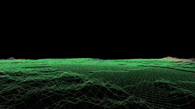
  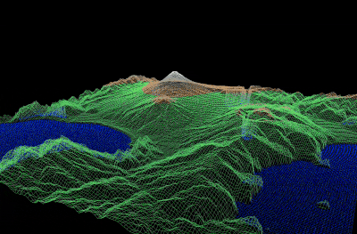
</p>
<p align="center"><sub>左: マップの中に入り込む FPS 視点 ／ 右: 実在の標高データから描いた富士山</sub></p>

**ポイント**

| 分類 | 項目 | 内容 |
| --- | --- | --- |
| 設計 | レンダリングパイプライン | 「座標変換 → 投影 → クリッピング → ラスタライズ」という描画の流れを参考に、各工程を段階的に分けて実装 |
| 数学 | アフィン変換 | 回転・拡大縮小・平行移動をまとめて扱う行列計算で、平面データを立体的に変換 |
| 数学 | 自然な回転 | オイラー角に加え、ジンバルロックを避けられるクォータニオン（四元数）を併用し、破綻のない回転を実現 |
| 表示 | 3 種類の投影 | 平行投影・透視投影・透視投影を応用した「FPS 視点」に対応。透視投影ではズーム操作も |
| 表示 | 多彩な配色 | 複数のカラーセット（色のアセット）から地形の配色を切り替え可能 |
| 描画 | 線と色 | ブレゼンハムのアルゴリズムで直線を描き、頂点間の色を線形補間してグラデーション表現 |
| 描画 | クリッピング高速化 | 画面外の線分を描く前に切り落とすコーヘン-サザーランド法で無駄な描画を削減 |
| 描画 | Z バッファリング | ピクセルごとに奥行きを記録し、手前が奥を正しく隠すように描画 |
| 描画 | 半透明パネル | カラーブレンディング（アルファ合成）で操作方法などの透過パネルを表示 |
| データ | 実在の地形 | 国土地理院の標高タイルを fdf 形式に変換し、富士山や世界地図を 3D 表示 |
| UX | 直感的な操作性 | 視点に合わせて回転軸を取り直すなど、回転・移動・拡大縮小・投影切り替えを快適に操作 |

<p align="center">
  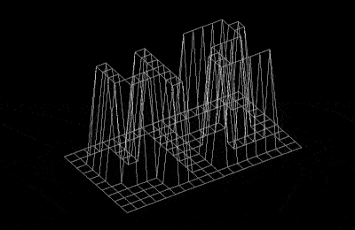
  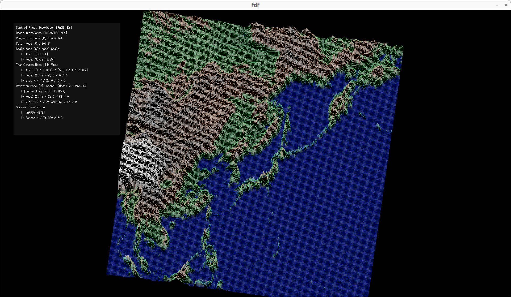
  
</p>
<p align="center"><sub>左: 基本の表示（「42」） ／ 中央: 操作パネル付きの高密度表示（日本周辺）／ 右: 世界全体の標高データ</sub></p>

</details>

---

<details>
<summary><b>🔢 push_swap — 数列を最小手数で並び替えるソート</b></summary>

**ひとことで言うと**: 2 つのスタックと限られた数種類の操作（先頭2つを入れ替える `swap`、回転させる `rotate`、もう一方へ移す `push` など）だけを使ってバラバラの数列を昇順に並べ替え、その手順を出力するプログラムです。**いかに少ない手数で並べ替えるか**が評価のポイントになります。

既存の解法をなぞるのではなく、**アルゴリズムを 0 から自分で考案**し、大幅な改善を達成しました。

| 要素数 | 手数の中央値 | （参考）満点ライン |
| ------ | ------------ | ------------------ |
| 100 個 | **424** 手 | 700 手未満 |
| 500 個 | **3,242** 手 | 5,500 手未満 |

<p align="center">
  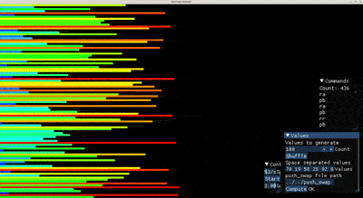
  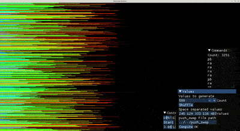
</p>
<p align="center"><sub>ビジュアライザでソートの様子を可視化 — 左: 100 要素 ／ 右: 500 要素</sub></p>

**ポイント**

| 工夫 | 内容 |
| --- | --- |
| 前処理 | 「すでに正しい順序で並ぶ最大のグループ（最長増加部分列:LIS）」を見つけ、動かす必要のない要素を確定して無駄な操作を削減 |
| モンテカルロ法 | Xorshift の乱数で挿入順を大量にランダム試行し、より手数の少ない解を探索。メモ化（メモライゼーション）で再計算を省き、現実的な時間で高速に探索 |
| メタヒューリスティクス × データ分析 | 問題の特性を見極めて、評価関数を重みづけし、大量のテスト結果を統計的に分析しながらパラメータを調整 |
| 安定した性能 | 要素数が増えても効率が落ちにくく、入力の並びで手数が大きくブレない（500 個で 3,137〜3,334 手と狭い範囲に収束） |

</details>

---

<details>
<summary><b>📡 minitalk — シグナルだけで文字列を送受信</b></summary>

**ひとことで言うと**: 通常の通信手段を使わず、OS の「シグナル」という最小限の合図 2 種類（`SIGUSR1` / `SIGUSR2`）**だけ**でクライアントからサーバへ文字列を送る課題です。

<p align="center">
  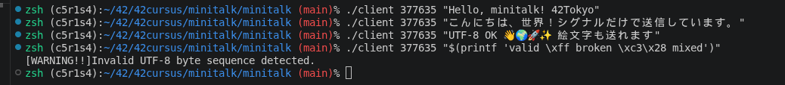
</p>
<p align="center"><sub>▲ クライアント送信側 — ASCII・日本語・絵文字、そして不正な UTF-8 を送信（不正検出時は警告）</sub></p>
<p align="center">
  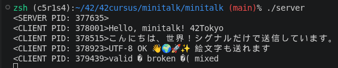
</p>
<p align="center"><sub>▲ サーバ受信側 — 日本語・絵文字も化けず届き、不正なバイト列は � (U+FFFD) に置換される</sub></p>

**通信のしくみ**

| 項目 | 内容 |
| --- | --- |
| 0 と 1 で文字を送る | 1 文字 = 8 ビットに分解し、2 種類のシグナルを「0」「1」に見立てて上位ビットから送信。サーバ側で 8 ビットごとに 1 文字へ復元 |
| 送信元の特定 | `sigaction` + `siginfo_t`（`SA_SIGINFO`）で送信元プロセスを取得し、ACK 応答や複数クライアントの識別を実現 |
| 取りこぼしを防ぐ ACK | サーバが 1 ビットごとに確認シグナルを返信し、クライアントは ACK を待ってから次を送信。シグナルの消失を防止 |
| 指数バックオフ＋タイムアウト | ACK 待ちを 1 → 2 → 4… と倍々に広げて CPU の無駄打ちを抑制。無応答ならタイムアウトで接続エラー検出 |
| 複数クライアントの排他制御 | 通信中に別クライアントが割り込むと `SIGUSR2`（NAK）で拒否し混線を防止。接続中の PID を表示 |

**UTF-8 を規格に忠実に処理**（[📝 解説記事を Qiita に執筆](https://qiita.com/takau-jp/items/13b628e0c5542d396fc3)）

| 観点 | 内容 |
| --- | --- |
| 規格の調査 | 「正しく解釈・正しく処理・不正データを安全に扱う」という Unicode 準拠の 3 要件を目標に、Unicode コンソーシアムの仕様書や W3C のエンコーディング標準を調査 |
| 多様な不正検出 | ビットパターンの誤りに加え、非最短形式（overlong）、サロゲート領域（U+D800–U+DFFF）や U+10FFFF 超の不正コードポイント、非文字（計 66 個）まで検出 |
| 安全な置換（最大部分置換） | 壊れた箇所を有効に読めた単位ごとに U+FFFD へ置換。削除はセキュリティリスクになるため、削除ではなく置換で安全に処理 |

</details>

---

<details>
<summary><b>🍝 philosophers — 並行処理の古典問題のシミュレーション</b></summary>

**ひとことで言うと**: 「食事する哲学者の問題」という有名な並行処理の課題。複数の処理を同時に走らせたときに起きる **取り合い（デッドロック）や順番待ちによる餓死** を起こさずに、全員が食事・睡眠・思考を続けられるようシミュレートします。

<p align="center">
  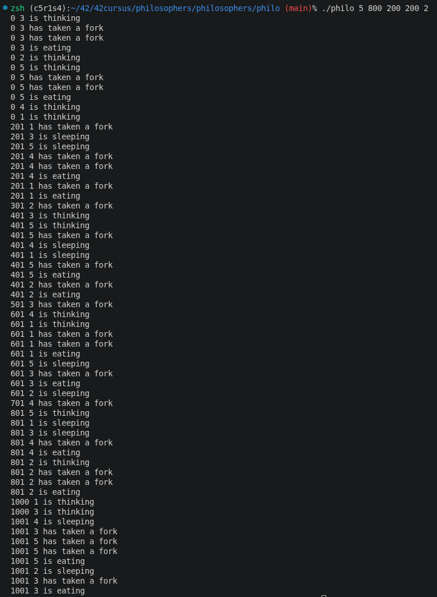
</p>
<p align="center"><sub>実行例 <code>./philo 5 800 200 200</code> — 各哲学者の状態がミリ秒のタイムスタンプ付きで出力される</sub></p>

**ポイント**

| 工夫 | 内容 |
| --- | --- |
| 2 つの並行モデル | 基本課題は「スレッド」＋ mutex（排他制御）、発展課題は「プロセス」＋セマフォという別方式で実装し、両方を比較 |
| 時間にシビアな制御 | 規定時間内に食事できないと「死亡」扱いになるため、ミリ秒単位の正確なタイミング管理を実装 |

</details>

---

<details>
<summary><b>🐚 minishell — bash のクローンを自作 👥</b></summary>

> 👥 **チーム開発**（2 人）で取り組んだプロジェクトです。

**ひとことで言うと**: 普段ターミナルで使う bash のような **シェル（コマンドを受け取って実行するプログラム）** を自作する課題です。入力された文字列を解析して、実際にコマンドとして動かします。

<p align="center">
  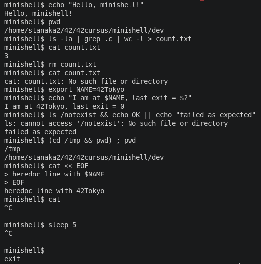
  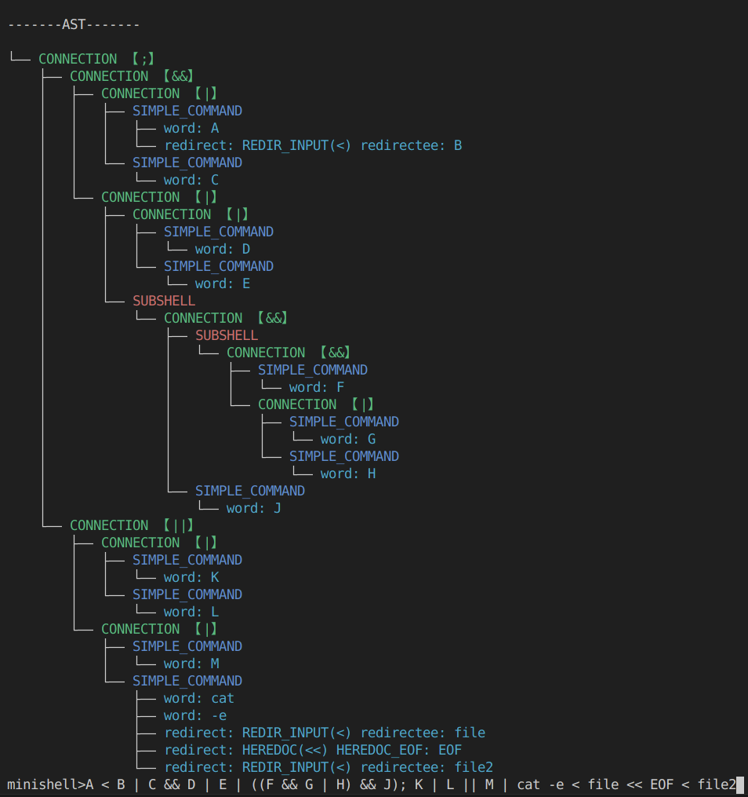
</p>
<p align="center"><sub>左: 実際の動作例（<code>Ctrl-C</code> まで）／ 右: 複雑な入力を解析した AST の可視化</sub></p>

**インタプリタのパイプラインを実装**

入力を以下の工程に分けて処理し、bash の挙動を再現しています。

```text
入力 → 字句解析（lexer）→ 構文解析（parser）→ AST 構築
     → 展開（expander）→ 評価（evaluator）→ 実行（executor）
```

実際の処理フロー（関数単位）は次の図のとおりです。

<p align="center">
  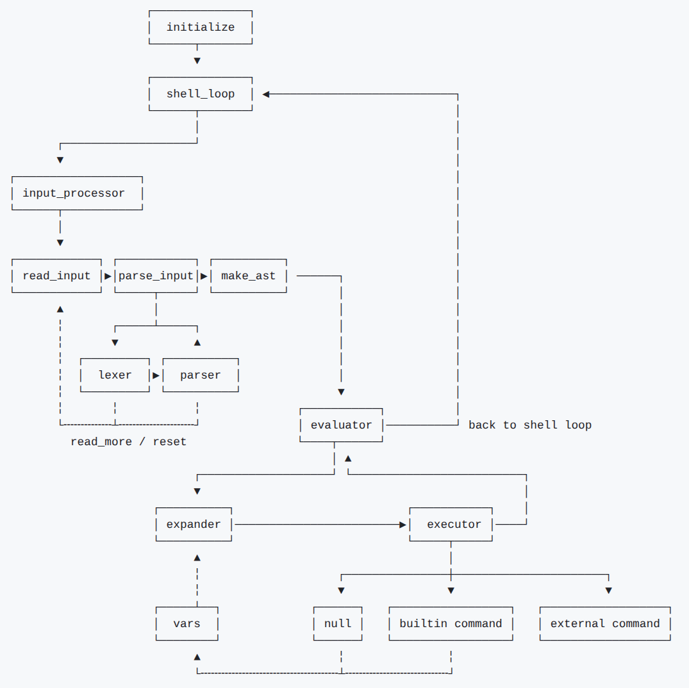
</p>

**ポイント**

| 項目 | 内容 |
| --- | --- |
| トークン化と AST 構築 | 入力をトークンに分解し、演算子の優先順位（`;` < `&&`/`\|\|` < `\|` < コマンド）で抽象構文木（AST）を構築。木をたどって実行順序を正しく制御 |
| 制御構造 | パイプ（`\|`）・論理演算（`&&` / `\|\|`）・コマンド区切り（`;`）・`( )` のサブシェル（子プロセスで隔離）に対応 |
| 多彩なリダイレクト | `>` `<` `>>` に加え、ヒアドキュメント（`<<`）まで実装 |
| 本格的な変数展開 | 環境変数・`$?`（終了ステータス）の展開、クォート/エスケープ処理、IFS によるワードスプリッティングなど bash 相当 |
| 3 種類の変数スコープ | 環境変数・シェル変数・一時環境変数（`VAR=value command`）を区別し、`export` の有無による挙動も再現 |
| ビルトイン | `cd` `echo` `env` `exit` `export` `pwd` `unset`。状態を変えるものは fork せず親で実行（NO_FORK）して反映 |
| シグナル対応 | `Ctrl-C` / `Ctrl-\` / `Ctrl-D` を、対話入力中・ヒアドキュメント中・コマンド実行中それぞれで本物らしく処理 |

</details>

---

<details>
<summary><b>🟩 Wordle — 単語当てゲーム（CLI / Web）👥</b></summary>

> 👥 **チーム開発**（2 人）で取り組んだプロジェクトです。

**ひとことで言うと**: 隠された単語を数回の試行で当てる人気ゲーム Wordle のクローンです。**2 つのバージョン**を作りました。

<p align="center">
  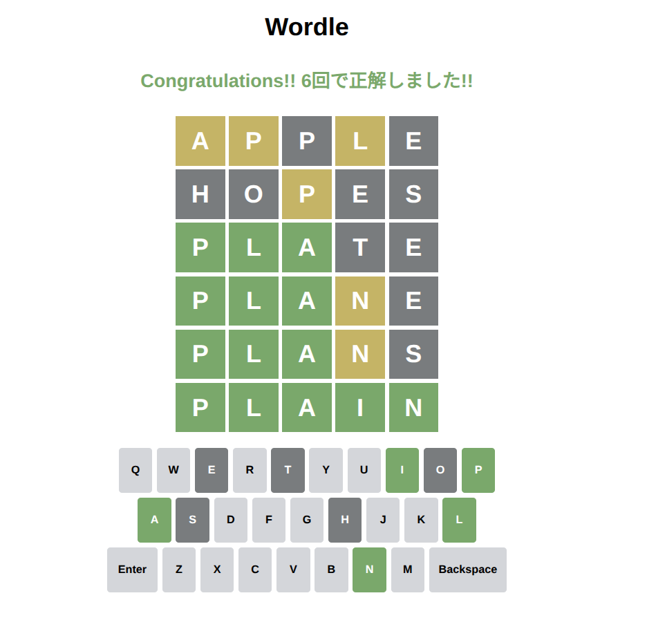
</p>
<p align="center"><sub>ブラウザで動く Web 版（TypeScript）</sub></p>

**ポイント**

| バージョン | 内容 |
| --- | --- |
| CLI 版（C++） | ゲーム進行・判定・辞書・画面表示などの役割ごとにクラスを分けたオブジェクト指向設計。ターミナル上で色付き表示 |
| Web 版（TypeScript） | TypeScript + HTML + CSS でブラウザ上で動作。`make web` でローカルサーバを起動してプレイ可能 |

</details>

---

<p align="center">
  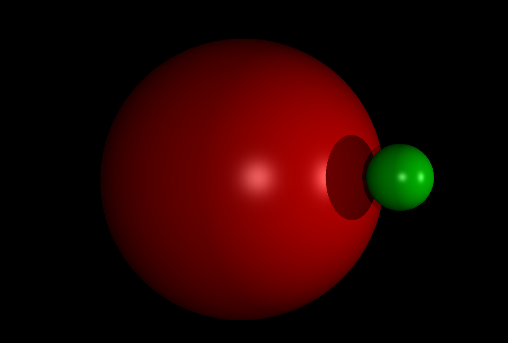
</p>
<p align="center"><sub>🚧 開発中の miniRT — レイトレーシングによる球の陰影・反射のプレビュー</sub></p>
